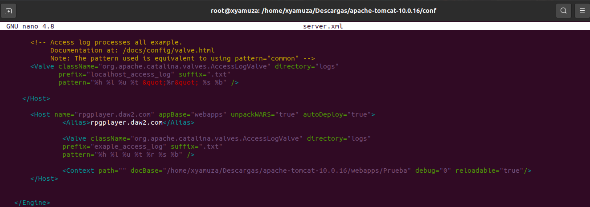
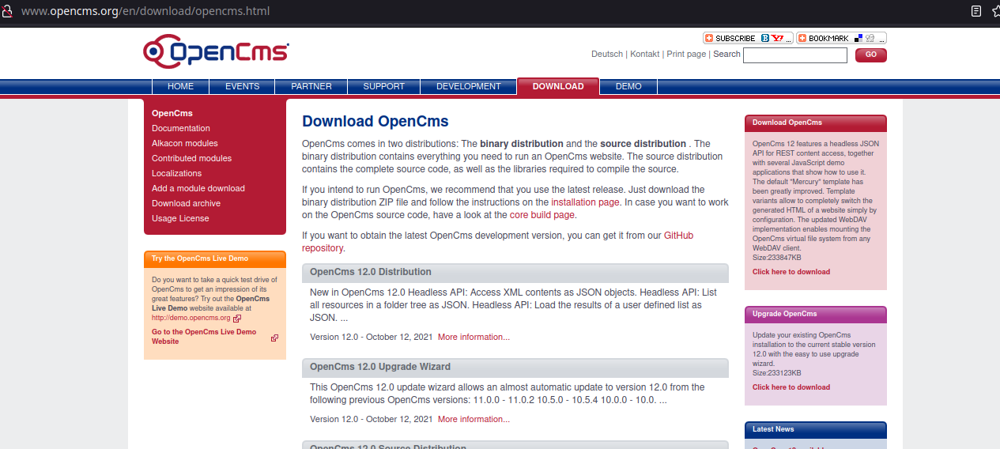
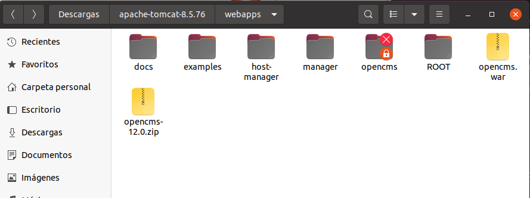
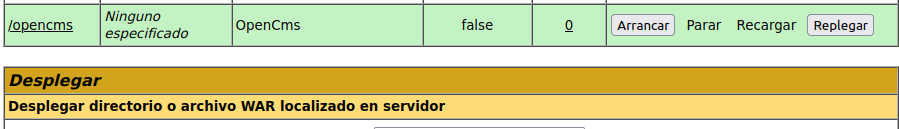

## 1.- Virtual hosting amb Tomcat

Primero de todo debemos editar el siguiente fichero:
> sudo nano /home/xyamuza/Descargas/apache-tomcat-10.0.16/conf/server.xml

Aquí deberemos crear un nuevo Host con las siguientes caracteristicas:

- name: nombre del host 
- Alias: Nombre host para acceder desde el navegador web a traves de la url

Una vez hecho esto deberemos indicar en nuestro fichero /etc/hosts el nombre de nuestra IP más el virtualhost que hemos creado y ya tendremos nuestro sitio listo:

## 2- Instala i desplega OpenCms

Primero tenemos que descargar el OpenCms
> http://www.opencms.org/en/download/opencms.html

Una vez descargado OpenCms deberemos descargar una version anterior de TomCat, en concreto la **8.5.76**.

Ahora descomprimimos **opencms-12.0.zip** y movemos el .war a la raiz de **/apache-tomcat-8.5.76/webapps**

Una vez hecho esto ya tendremos desplegado **OpenCms** en TomCat.
Tan solo tendremos que arrancar la aplicación desde el Gestor de Aplicaciones de TomCat.

Una vez arrancado sin problemas nos debe salir el siguiente mensaje:	

>OK - Arrancada aplicación en trayectoria de contexto [/opencms]
