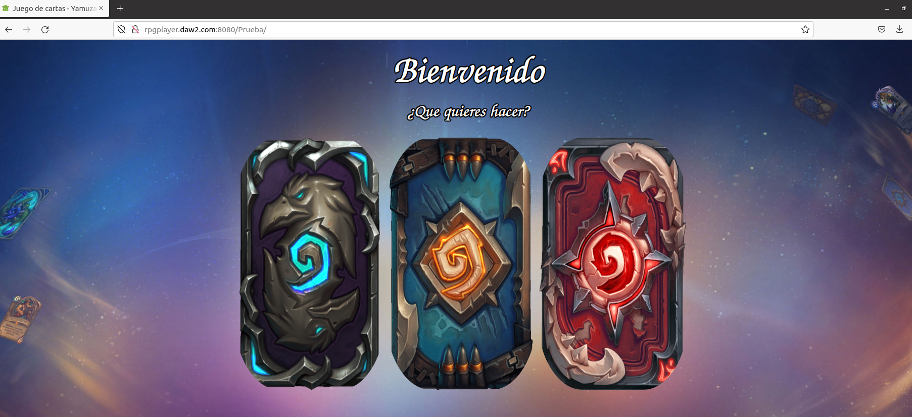

## 1.- Virtual hosting amb Tomcat

Primero de todo debemos editar el siguiente fichero:
> sudo nano /home/xyamuza/Descargas/apache-tomcat-10.0.16/conf/server.xml

Aquí deberemos crear un nuevo Host con las siguientes caracteristicas:

- name: nombre del host 
- Alias: Nombre host para acceder desde el navegador web a traves de la url

Ahora para que nuestra maquina resuelva la dirección IP y la relacione con la URL que le hemos indicado en el paso anterior, deberemos modificar el siguiente fichero en Ubuntu:

> sudo nano /etc/hosts

Deberemos indicarle la IP de la máquina donde tenemos TomCat y el nombre del virtualhost:

Una vez hecho esto deberemos indicar en nuestro fichero /etc/hosts el nombre de nuestra IP más el virtualhost que hemos creado y ya tendremos nuestro sitio listo:

## 2- Instala i desplega OpenCms

Primero tenemos que descargar el OpenCms
> http://www.opencms.org/en/download/opencms.html

Una vez descargado OpenCms deberemos descargar una version anterior de TomCat, en concreto la **8.5.76**.

Ahora descomprimimos **opencms-12.0.zip** y movemos el .war a la raiz de **/apache-tomcat-8.5.76/webapps**

Una vez hecho esto, ya tendremos desplegado **OpenCms** en TomCat.

Tan solo tendremos que arrancar la aplicación desde el Gestor de Aplicaciones de TomCat.

Una vez arrancado, si todo ha ido bien, nos debe aparecer el siguiente mensaje:	

>OK - Arrancada aplicación en trayectoria de contexto [/opencms]

Si nos aparece algún error como este:

>FALLO - No se pudo arrancar la aplicación en trayectoria de contexto [/opencms]

>FALLO - Encontrada excepción [org.apache.catalina.LifecycleException: Failed to start component [StandardEngine[Catalina].StandardHost[localhost].StandardContext[/opencms]]]

Seguramente sea por que tenemos una versión de TomCat incompatible con OpenCms.

Una vez desplega, en el navegador agregamos la siguiente url:
>localhost:8080/opencms/setup

En este paso nos hará un check de los requisitos necesarios para que funcione OpenCms:

En el siguiente paso deberemos configurar MySql con OpenCms, en nuestro caso crearemos un usuario en MySql con los siguiente comandos:
> sudo mysql

Ahora indicaremos el usuario y contraseña que hemos creado en el paso anterior:

Dejaremos las opciones por defecto

Y ahora esperaremos que acabe con la instalación
